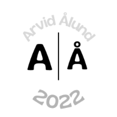

<!-- Improved compatibility of back to top link -->

<a id="readme-top"></a>

<!-- PROJECT SHIELDS -->

[![Contributors][contributors-shield]][contributors-url]
[![Forks][forks-shield]][forks-url]
[![Stargazers][stars-shield]][stars-url]
[![Issues][issues-shield]][issues-url]
[![project_license][license-shield]][license-url]
[![LinkedIn][linkedin-shield]][linkedin-url]

<!-- PROJECT LOGO -->
<br />
<div align="center">
  <a href="https://github.com/ArvidAlund/game-portfolio">
    
  </a>

  <h3 align="center">Game Portfolio</h3>

  <p align="center">
    En interaktiv portfolio byggd med en spelinspirerad design där användaren kan utforska dina projekt, färdigheter och kontaktuppgifter som om det vore en spelvärld.
    <br />
    <a href="https://game-portfolio-six.vercel.app/"><strong>Besök portfolion »</strong></a>
    <br />
    <br />
    <a href="https://github.com/ArvidAlund/game-portfolio">Visa demo</a>
    &middot;
    <a href="https://github.com/ArvidAlund/game-portfolio/issues/new?labels=bug&template=bug-report---.md">Rapportera bugg</a>
    &middot;
    <a href="https://github.com/ArvidAlund/game-portfolio/issues/new?labels=enhancement&template=feature-request---.md">Föreslå funktion</a>
  </p>
</div>

---

## 🎮 Portfolio | Game Time

### 🌐 Länk

🔗 [https://game-portfolio-six.vercel.app/](https://game-portfolio-six.vercel.app/)

---

## 📖 About The Project

Denna portfolio är designad som ett **spel** där användaren navigerar mellan olika zoner som representerar delar av min utvecklarresa — som "About Me", "Projects", "Skills" och "Contact".  
Syftet är att skapa en upplevelse som känns levande, personlig och lekfull — samtidigt som den visar upp min kompetens som webbutvecklare.

[![Product Screenshot][product-screenshot]](https://game-portfolio-six.vercel.app/)

### Wireframe / Koncept

#### 🏠 Zone 0 – Start (Hub / Main Menu)

- En central plats – hub world.
- Avatar av dig själv.
- HUD visar stats:
- Knappar: `Starta äventyret` / piltangenter för att utforska.
- Interaktivitet: klicka vid hus för att gå vidare till andra delar.

#### 📜 Zone 1 – About Me

- Visuellt: bibliotek eller hus med din personliga story.
- Presentation + tidslinje med din utvecklarresa.
- Avatar levlar upp (student → junior → fullstack).
- “Bläddra i bok” = CV-modal.
- Easter egg: Tryck på avataren → `"Coffee-driven developer ☕"`.

#### 🧰 Zone 2 – Projects

- Visuellt: marknad/dungeon med kistor/portaler.
- Varje projekt = kista som öppnar modal med:
  - Namn
  - Tech stack (ikoner)
  - Repo-länk + live demo
- Kategorier:  
  🟦 Frontend 🟩 Backend 🟪 Fullstack
- Interaktivitet: “Loot chest”-animation, filter i HUD.

#### ⚔️ Zone 3 – Skills

- Visuellt: dojo eller futuristiskt “skill tree”.
- Skills representerade som items (svärd = React, sköld = Node).
- Hover → erfarenhetsnivå (basic/intermediate/advanced).
- Klick → exempel på användning i kod/projekt.

#### 🔮 Zone 4 – Contact

- Visuellt: “Boss gate” eller stor portal.
- Kontaktformulär (namn, mejl, meddelande).
- Länkar till LinkedIn, GitHub.
- Easter egg: “hire me” → special animation.

#### 🧩 HUD / Meny (alltid synlig)

- Avatar + namn
- XP-bar som fylls när man utforskar
- Snabbnavigation: Home | Projects | Skills | Contact

#### 🏆 Gamification

- Achievements:
  - “Explorer” (besökt alla zoner)
  - “Quest Master” (kollat alla projekt)
- Mini-game gömt (Snake/Pong)
- Retro cheat code: ↑ ↑ ↓ ↓ ← → ← → B A → hemlig sektion

<p align="right">(<a href="#readme-top">back to top</a>)</p>

---

## 🧱 Built With

- [![Next][Next.js]][Next-url]
- [![React][React.js]][React-url]
- [![GSAP][GSAP-shield]](https://greensock.com/gsap/)
- [![Vercel][Vercel-shield]](https://vercel.com/)
- [![TailwindCSS][Tailwind-shield]](https://tailwindcss.com/)

<p align="right">(<a href="#readme-top">back to top</a>)</p>

---

## 🚀 Getting Started

För att köra projektet lokalt:

### Installation

1. Klona repot

   ```bash
   git clone https://github.com/ArvidAlund/game-portfolio.git
   ```

2. Installera beroenden

   ```bash
   npm install
   ```

3. Starta utvecklingsservern

   ```bash
   npm run dev
   ```

4. Öppna http://localhost:3000 i webbläsaren.

<p align="right">(<a href="#readme-top">back to top</a>)</p>

## 📫 Contact

Arvid Ålund
[LinkedIn](https://www.linkedin.com/in/arvid-%C3%A5lund-6037342a3/)
• [GitHub](https://github.com/ArvidAlund)

Projektlänk: https://github.com/ArvidAlund/game-portfolio

<p align="right">(<a href="#readme-top">back to top</a>)</p>

## 🧾 License

Distributed under the MIT License. See LICENSE.txt for more information.

[contributors-shield]: https://img.shields.io/github/contributors/ArvidAlund/game-portfolio.svg?style=for-the-badge
[contributors-url]: https://github.com/ArvidAlund/game-portfolio/graphs/contributors
[forks-shield]: https://img.shields.io/github/forks/ArvidAlund/game-portfolio.svg?style=for-the-badge
[forks-url]: https://github.com/ArvidAlund/game-portfolio/network/members
[stars-shield]: https://img.shields.io/github/stars/ArvidAlund/game-portfolio.svg?style=for-the-badge
[stars-url]: https://github.com/ArvidAlund/game-portfolio/stargazers
[issues-shield]: https://img.shields.io/github/issues/ArvidAlund/game-portfolio.svg?style=for-the-badge
[issues-url]: https://github.com/ArvidAlund/game-portfolio/issues
[license-shield]: https://img.shields.io/github/license/ArvidAlund/game-portfolio.svg?style=for-the-badge
[license-url]: https://github.com/ArvidAlund/game-portfolio/blob/master/LICENSE.txt
[linkedin-shield]: https://img.shields.io/badge/-LinkedIn-black.svg?style=for-the-badge&logo=linkedin&colorB=555
[linkedin-url]: https://www.linkedin.com/in/arvid-%C3%A5lund-6037342a3/
[Next.js]: https://img.shields.io/badge/next.js-000000?style=for-the-badge&logo=nextdotjs&logoColor=white
[Next-url]: https://nextjs.org/
[React.js]: https://img.shields.io/badge/React-20232A?style=for-the-badge&logo=react&logoColor=61DAFB
[React-url]: https://reactjs.org/
[GSAP-shield]: https://img.shields.io/badge/GSAP-88CE02?style=for-the-badge&logo=greensock&logoColor=white
[Vercel-shield]: https://img.shields.io/badge/Vercel-000000?style=for-the-badge&logo=vercel&logoColor=white
[Tailwind-shield]: https://img.shields.io/badge/TailwindCSS-38B2AC?style=for-the-badge&logo=tailwindcss&logoColor=white
